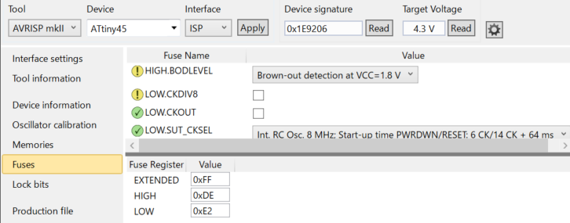

# Atmel ATtiny45 DCC Decoder Firmware

NMRA規格の信号を受信して作動する、モーター駆動専用のDCCデコーダーのファームウェアです。

Atmel AVR ATtiny45 / ATtiny85で動作できるように作成してあります。
 (プログラム領域が足りないため、ATtiny25には入りません)

※ATtiny45の場合、Debug Buildではプログラム領域をオーバーしますので、必ずRelease Buildでお使いください。

## 主要スペック
  * ATtiny45 / ATtiny85の内蔵クロック(8MHz)で動作可能
  * 14-Step、28-Step、128-Stepの信号を受信可能。
  * 14-Step、28-Stepの場合はスピードテーブル、128-Stepの場合は最小電圧、中間電圧、最大電圧を設定可能。
  * 7-Bit Address、14-Bit Addressどちらの設定にも対応
  * Pagedモード、Directモード、Operationモードでのプログラミングに対応
  * アナログコントローラーでの操作に対応。 純直流出力コントローラーだけではなく、PWM出力コントローラーにおいてもある程度は正常に制御可能
  * アナログコントローラーで操作する場合の最大速度、加減速度はDCC走行時とは別の値を設定可能

## 動作確認済みのコマンドステーション・コントローラー類
### DCC走行
  * Digitrax DCS50K (Kato D101)
  * Digitrax DCS100
  * Roco Z21

### アナログ走行
  * TOMIX N-1000CL
  * KATO スタンダードS
  * KATO スタンダードSX

## 対応する基板設計データ
  * [Atmel ATtiny45 DCC Decoder PCB Data](https://github.com/ytsurui/dcc-motordecoder-pcb)

回路を独自に組んで動かす場合は、基板設計データに含まれる回路図を参考にしてください。

## 開発環境
  * [Atmel Studio 7.0.2397](https://www.microchip.com/mplab/avr-support/atmel-studio-7)

## 各種ドキュメント

  * [CV値一覧](docs/CVList_ja.md)
  
## AVR Fuse Bitの設定内容

8MHz内蔵オシレーターで動作するようにするため、下記の内容を書きます。
 (表記はAtmel Studioのものとなります)

  * EXTENDED: 0xFF
  * HIGH: 0xDE
  * LOW: 0xE2

Atmel Studioで設定を行う場合、「LOW.CKDIV8」のチェックを外し、「HIGH.BODLEVEL」を「Brown-out detection at VCC=1.8V」に切り替えてください。

